# Peony 
## Overview
The peony can view files and folders on the system categorically, supporting common operations for files and folders, and its main interface is shown in figure below.

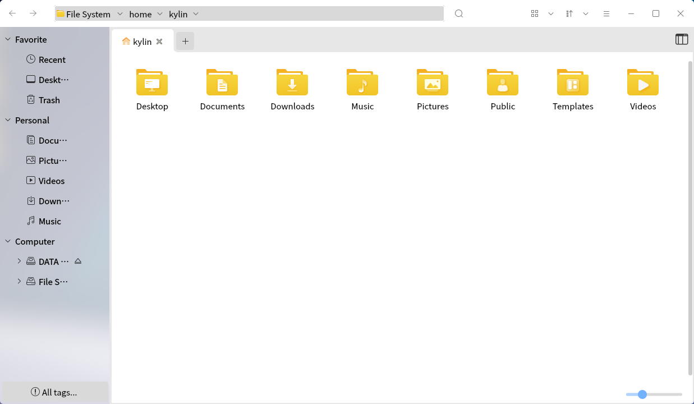

## Basic Function
### File Name

(1)The maximum length of the system file name can be 255 characters, usually by letters, numbers, "."(dotted), "_"(underlined) and "-"(minus).

(2)"-"cannot be the first letter of a file name.

(3)File names cannot contain the "/"symbol; because "/"is in the operating system directory tree and indicates a separator symbol in the root directory or path.

### Path
(1)When using a file in the current directory, users can quote the file name directly; if users want to use a file in another directory, users must specify the directory where the file is located.

(2)The absolute path is certain and the relative path changes with the user's working directory.

**Absolute path** —— A path from the root directory, such as "/home/kylin/test"

**Relative path** —— The path from the current directory.For example, when located in the /home directory, the relative path of the test file is "kylin/test"

There are "."and ".."files under each directory.

(3)The "."file representing the current directory and the ".."file representing the directory level above the current directory.When located in the /etc directory, the relative path of the test file is represented as... "/home/kylin/test"

### File Type
The system supports file types such as those in table below. 

|File type| Description
| :------------ | :------------ |
| General files| Includes text files, data files, executable binaries, etc
| Contents files(contents)|The system views the directory as a special file and uses it to form a hierarchical tree structure of the file system
| Equipment files(Character device file/block device file)|The system uses it to identify individual device drivers, which the kernel uses to communicate with hardware devices
|Symbolic link|Stored data is the path to a file in the file system;When a symbolic link file is invoked, the system will automatically access the paths saved in the file

 

## Window Composition
The Peony window can be divided into the toolbar and address bar, the folder label preview area, the sidebar, the window area and status bar, and the preview window in six sections.

### Toolbar And Address Bar
The functions corresponding to the icons on the toolbar are shown in table below.

|Icons|Description|Icons|Description
| :------------ | :------------ | :------------ | :------------ |
||New folder	||Command line
||Return to previous level||Retreat
||Search folders,files, etc. with advanced search functions||Select the view mode (small icon, medium icon, large icon)
||Select the sorting method (name, modification date, etc.)||Advanced features
||Minimize||Maximize
||Close||||

 

### Folder Tag Preview Area
Users can view open folders through the folder tab preview area and are able to add additional folders by clicking the ""icon to add additional folders.

### Sidebar
The sidebar lists the directory hierarchy for all files, providing a view of the different types of folder directories in users operating system.External mobile devices, remotely connected shared devices are also shown here.

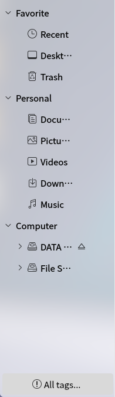

### Window Area
The window area lists the subdirectories, files under the current directory node.In the sidebar list, click on a directory, the contents of which should be displayed here, and the ""icon indicates that the file is selected as shown in figure below.

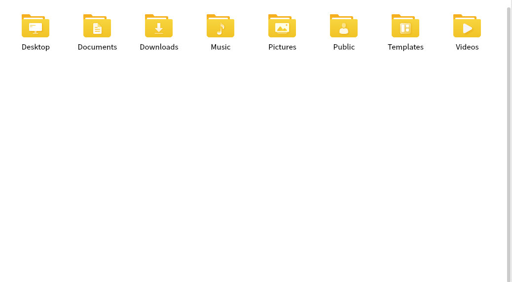

### Status Bar
(1)When entering a directory, the number of files in the current location is displayed.

(2)When a folder is selected, the number of files in that folder is displayed.

(3)When a file is selected, the type and size of that file is displayed.

(4)The slider in the bottom right corner is a zoom bar that can be dragged to adjust the file size.

### Preview Window
Click on the preview icon in the upper right corner of the preview window to preview the details of the file, to the picture file as an example.In the preview window users can view the image name, type, size, creation time, resolution and other information, and underneath the image information, users can also rotate, edit, delete and other operations on the image.

|Icons|Description|Icons|Description
| :------------ | :------------ | :------------ | :------------ |
||Document Preview Only||Document details preview

 

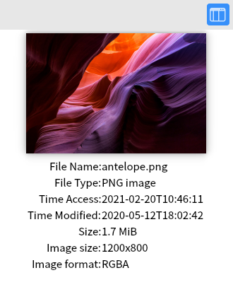
 

## Main Function
### View 
Users can use the peony to view and manage files on local files, local storage devices (such as external hard drives), file servers and network shares.

In the peony , double-click any folder to view its contents (by default application);Or right-click a folder to open it in a new tab or new window.

#### View mode
By default, the system displays all files and directories in the form of icons.

The user can select the file view mode by clicking the ""icon to select the file view mode, the icon can be set to: large icon, small icon, list, details, tiled five modes.

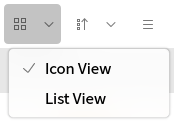

In the icon view, files in the peony are displayed as <big icon + file name>, like Fig 1.

In the list view, files in the  peony are displayed as <small icon + file name + file information>.

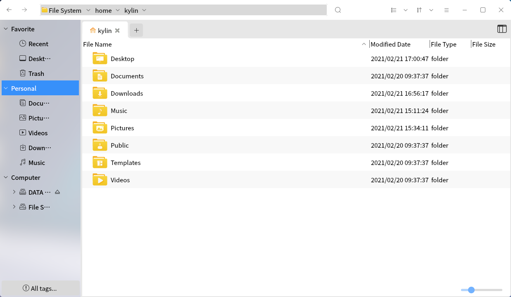

#### Sort By
Files can be sorted in different ways while browsing. The way the files are arranged depends on the folder view method currently in use, and the user can change it by clicking the ""icon on the toolbar to change it.

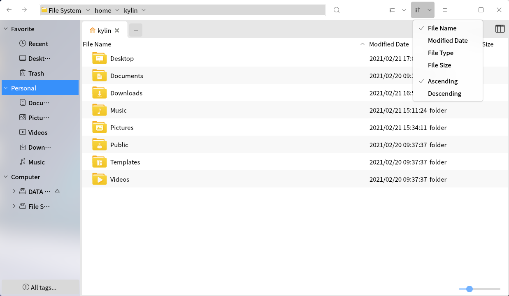

The various documents are sorted as follows:

(1)Sort by name: Alphabetical order by file name.

(2)Sort by modification date: Sort by the date and time the file was last changed; by default it is sorted from oldest to newest.

(3)Sort by type: files are sorted alphabetically by file type; similar files are grouped together and then sorted by name.

(4)Sort by size: Sort by file size; by default it is sorted from smallest to largest.

(5)Sort by creation date: Sort by the date the file was created; by default it is sorted from earliest to most recent.

(6)Sort by folder path: sort by path of folder storage.

(7)Sort by tag: The file manager provides the tagging function, and after the user tags, the default sort by tag is, sort by color red > orange > yellow > green > green > blue > purple > gray > no color.

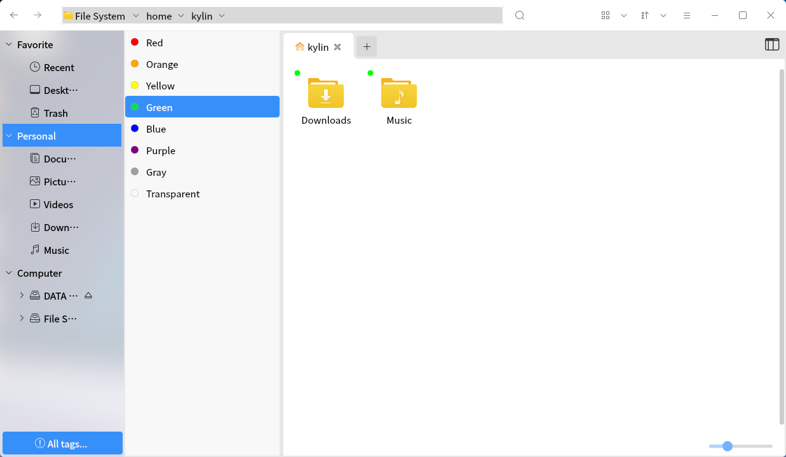

(8)Incremental sorting: sort documents in numerical, alphabetical ascending order.

(9)Descending sorting: sort documents in numerical, alphabetical descending order.

(10)Sort items ... : By selecting this item, the user can customize the sorting method in the menu.

### Advanced Search Function
The Peony provides advanced search for users, using the Simple Search feature by default.Simple search function:Click the ""icon button to switch to the search input box.users can search for files in the current directory by entering the contents in the search box and pressing the Enter key.

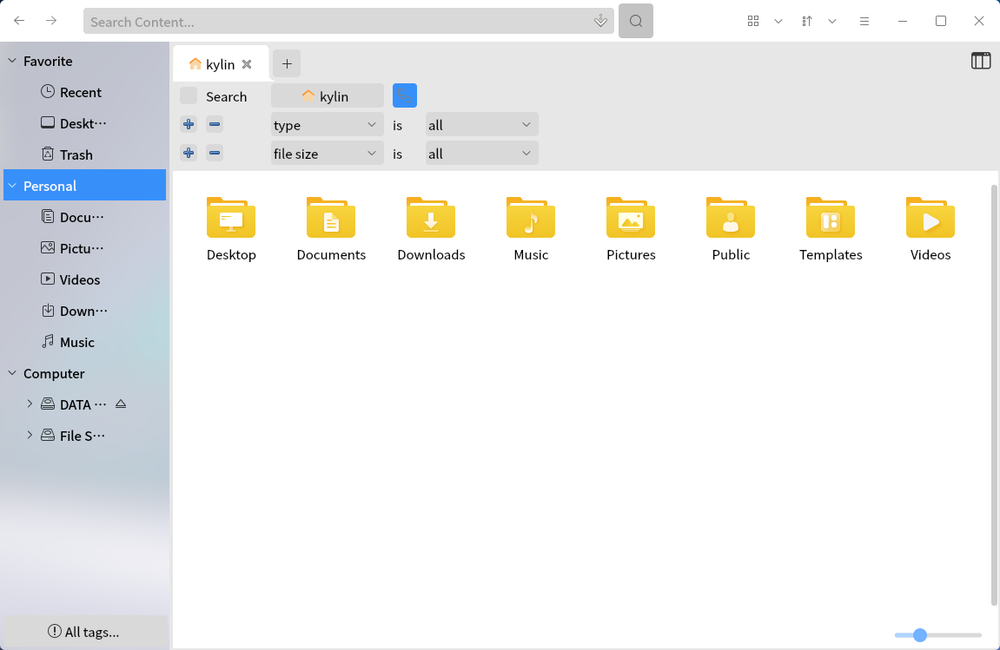

Advanced search function:Under the current directory (contains subdirectories), user-defined conditions are available.Search by name for keywords, type for file type, file size for file size to be searched, modification time for a certain time period, etc. As shown in Fig 12.

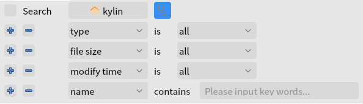

### Common Operation
(1)Copy

* Way 1:Check, right-click > "Copy"> Target, right-click > "Paste"

* Way 2:Check, Ctrl+C > Target, Ctrl+V

* Way 3:Drag from the folder window where the project is located to the destination folder window

In way 3, if both folders are on the same hard disk device on the computer, the item is moved;If dragged from a USB stick to the system folder, the item will be copied.To drag copy on the same device, users need to hold down "Ctrl"while dragging.

(2)Move

* Way 1:Check, right-click > "Cut"> Target, right-click > "Paste"

* Way 2:Check, Ctrl+X > Target, Ctrl+V

(3)Delete

Delete to recycling bin:

* Way 1:Check, right-click > "Delete"

* Way 2:Selected, Delete

* Way 3:Select it and drag it to the "Trash"on the desktop

If the deleted files are on a removable device, eject the device without emptying the Trash, the deleted files on the removable device may not be visible on other operating systems, but they still exist;When the device is reinserted into the system used to delete this file, it will be visible in the Trash.

Delete permanently:

* Way 1:Delete again in the "Trash"

* Way 2:Selected, Shift+Delete

(4)Rename

* Way 1:Check, right-click > "Rename"

* Way 2:Selected, F2

To undo a rename, press Ctrl+Z to restore it.
### Formatting And Unloading Equipment
In the sidebar, for the device accessing the system, right-click and the menu appears as shown in figure below.

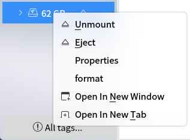

* Unload/pop:Both of these serve the purpose of offloading mobile devices.The difference is that the device still exists in the system after uninstallation (unmounted state) and can no longer be found in the system when ejected.The ""button on the right side of the device is the pop-up role.

* Formatting:System default format is FAT32 file system, users can change to Ext2/3/4 or NTFS format;To use this feature, users need to uninstall the device first.

### Access Network
Used to share files over a LAN.

Exp:Right-click "Music", select "Share", and a dialog box will pop up.18.Users can set information and permissions for shared folders.

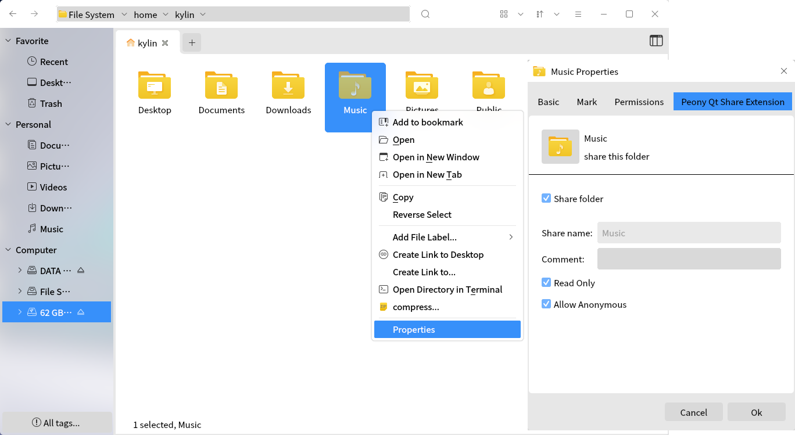

(1)When users click "Create", the folder icon will change to, indicating that it belongs to a shared file.

(2)On another system on the same LAN, open a peony , select "Browse Network"and find the host name of the shared file.When opened, users can see the file that was shared. Double-click the file to bring up the connection prompt box.

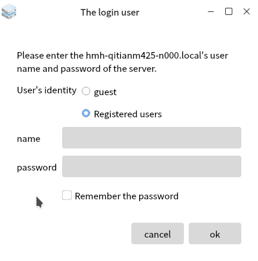

(3)After connecting, the contents of the shared file can be seen, and the connected host is also displayed in the sidebar.

(4)If users want to stop sharing the folder, users can right-click the folder again, and uncheck the sharing.

 

## Advanced Settings
Click the ""icon on the toolbar to enter the setup interface.

Advanced settings are the peony preferences.21,Preferences are divided into three parts: edit, share, and drop-down menus.

(1)Edit: copy, paste, cut and delete

(2)Share: sharing, printer, zip, mailbox sharing

(3)Drop-down menus: file safe, quick select (file name, extension, tag), hide file, file comparison, help, about.

|Icons|Description|Icons|Description
| :------------ | :------------ | :------------ | :------------ |
||	Reproduction of selected projects||	Paste selected items
	||Cut the selected item||Trash, empty all items	
	||Share selected projects||Printer and scanner functional items
	||Share the selected zip file||Send email function item

 

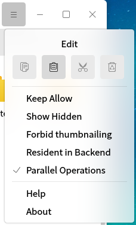

The content that can be set contains multiple aspects, and the functions corresponding to each tab are briefly described in table below.

|Tabs|Description
| :------------ | :------------ |
|Document safe|/
|Quick Select|Used filenames, extensions and a quick selection of tags for the project
|Hide files|Whether to hide the selected item or not
|Document comparison|/
|Help|Jump to User Manual
|About|Show details of the peony 

 

## Appendix
### 1 Shortcuts

|Shortcut key|Function|
| :------------ | :------------ |
| Ctrl+C|Copy |
| Ctrl+X|Cut|
| Ctrl+V|Paste|
| Delete|Delete|
| Shift+Delete|Permanent deletion|
| Ctrl+Z |Revoke|
| Ctrl+A|All|
| F2| Rename|

### 2 Wildcard Descriptions

|Wildcard|Description
| :------------ | :------------ |
|Asterisks（*）|Match zero or more characters|
|question mark（?）|Match any of the characters|
|[abl A-F]|Match any of the characters listed in square brackets, for example a, b, l or any of the uppercase characters from A to F|

### 3 Brief description of the system section

（1）/bin:Store command files that can be used by regular users.

（2）/boot:Contains files used by the kernel and other system programs when they start.

（3）/dev:The directory where the device files are located. The device is managed as a file in the operating system and can be manipulated as an operating file.

（4）/etc:The system's configuration file.

（5）/home:The location of the user's home directory, where user files are saved, including configuration files, documents, etc.

（6）/lib:Contains many shared library files that are used by programs in /bin.

（7）/opt:Store the files and programs that can be optionally installed, mainly by third-party developers to install their packages.

（8）/root:The home directory of the system administrator (root or superuser).

（9）/usr:Includes files and directories that are directly relevant to system users, and some major applications are also stored in this directory.

（10）/var:Contains some documents that change frequently. Such as false offline (spool) directories, file log directories, lock files, and temporary files.
