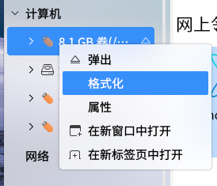

# 文件管理器
## 概述
文件浏览器可以分类查看系统上的文件和文件夹，支持文件和文件夹的常用操作，其主界面如下图所示。

## 基本要点
### 文件名
（1）系统文件名长度最大可以为255个字符，通常是由字母、数字、“.”（点号）、“_”（下划线）和“-”（减号）组成的。

（2）“.”为文件名首字母时，默认情况下会被隐藏，设置了显示隐藏文件才会显示。

（3）文件名不能含有“/”符号；因为“/”在操作系统目录树中，表示根目录或路径中的分隔符号。
### 路径

（1）使用当前目录下的文件时，可以直接引用文件名；如果要使用其他目录下的文件，就必须指定该文件所在的目录。

（2）绝对路径是一定的，相对路径是随着用户工作目录改变的。

绝对路径，即从根目录开始的路径，比如/home/kylin/test

相对路径，即从当前所在目录开始的路径，比如位于/home目录下时，test文件的相对路径为kylin/test

（3）每个目录下都有代表当前目录的“.”文件，和代表当前目录上一级目录的“..”文件。

当位于/etc目录下，test文件的相对路径则表示为../home/kylin/test。

### 文件类型
系统支持如下表中的文件类型。 

|文件类型|	说明
| :------------ | :------------ |
|普通文件	|包括文本文件、数据文件、可执行的二进制程序等
|目录文件（目录）|	系统把目录看成是一种特殊的文件，利用它构成文件系统的分层树型结构
|设备文件（字符设备文件/块设备文件）|	系统用它来识别各个设备驱动器，内核使用它们与硬件设备通信
|符号链接|	存放的数据是文件系统中通向某个文件的路径； 当调用符号链接文件时，系统将自动访问保存在文件中的路径

 

## 窗口组成
文件浏览器窗口可划分为工具栏和地址栏、文件夹标签预览区、侧边栏、窗口区和状态栏、预览窗口六个部分。

### 工具栏和地址栏
工具栏上图标对应的功能如下表。

|图标	|说明|	图标|	说明
| :------------ | :------------ | :------------ | :------------ |
||	返回上一级	||	后退
||	搜索文件夹、文件等，提供高级搜索功能	||	选择视图模式（图标视图、列表视图）
||	选择排序方式（名称、修改日期等）	||	高级功能
||最小化||		最大化
||	关闭		||||
	
 

### 文件夹标签预览区
用户可通过文件夹标签预览区查看已打开的文件夹，并能够通过点击“”图标添加其他文件夹。

### 侧边栏
侧边栏列出了所有文件的目录层次结构，提供对操作系统中不同类型文件夹目录的浏览。外接的移动设备、远程连接的共享设备也会在此处显示。

### 窗口区
窗口区列出了当前目录节点下的子目录、文件。在侧边栏列表中单击一个目录，其中的内容应就会在此处显示，文件图标高亮表示该文件被选中。

### 状态栏
（1）如果只选择文件夹，会显示选中的文件夹个数。

（2）如果选中的是文件，会计算选中的文件的总的大小。

（3）计算机视图中会显示选中的项目数(包括分区或者移动设备等)。

（4）右下角的滑动条为缩放条，可对文件大小进行拖动调节。

### 预览窗口
用过点击预览窗口右上角的预览图标即可对文件详情预览，以图片文件为例，在预览窗口可查看图片名称、类型、大小、创建时间、分辨率等信息，在图片信息的下方。

|图标	|说明|
| :------------ | :------------ |
||	仅文件预览
	
 

## 主要功能
### 查看文件和文件夹
用户可以使用文件浏览器查看和管理本机文件、本地存储设备（如外置硬盘）、文件服务器和网络共享上的文件。
在文件浏览器中，双击任何文件夹，可以查看其内容（使用文件的默认应用程序打开它）；也可以右键单击一个文件夹，在新标签页或新窗口中打开它。
#### 视图模式
默认情况下，系统以图标形式显示出所有的文件和目录。

用户通过点击“”图标可选择文件视图模式，可将图标设为：图标视图、列表视图模式，计算机目录还可设置计算机视图。

在图标视图中，文件浏览器中的文件将以<大图标+文件名>的形式显示。

在列表视图中，文件浏览器中的文件将以<小图标+文件名+文件信息>的形式显示。

#### 排序方式
浏览时，用户可以用不同的方式文件进行排序。排列文件的方式取决于当前使用的文件夹视图方式，用户可以单击工具栏上的“”图标来更改。

各种文件排序方式介绍如下：

（1）按名称排序：按文件名以字母顺序排列。

（2）按修改日期排序：按上次更改文件的日期和时间排序；默认情况下会从最旧到最新排列。

（3）按类型排序：按文件类型以字母顺序排列；会将同类文件归并到一起，然后按名称排序。

（4）按大小排序：按文件大小（文件占用的磁盘空间）排序；默认情况下会从最小到最大排列。

（5）设置升序/降序：根据对应的类型，按照从小到达或者从大到小的顺序排序。

（6）标记筛选：筛选出当前目录下添加了相同颜色标记的文件以及文件夹。

### 搜索和筛选功能
文件浏览器为用户提供搜索和筛选功能。

搜索功能即：点击“”图标按钮，可以切换到搜索输入框。

搜索框中输入内容然后按回车键，或者稍等片刻(小于1秒)即可在当前目录对文件进行搜索。

筛选功能即：在当前目录下或者对搜索出来的文件，用户可自定义条件，根据名称对应关键字、类型对应文件类型、文件大小对应要搜索的文件大小、修改时间对应某个时间段等进行筛选。筛选功能只能筛选当前目录下或者搜索之后的文件，不包含当前目录下子文件夹的筛选。

筛选框如下图所示。

展开全部类型的筛选条件，其弹窗如下图所示。

### 文件和文件夹常用操作
(1) 复制

* 方式1：选中，右键单击 > “复制” > 目标位置，右键单击 > “粘贴”

* 方式2：选中，Ctrl+C > 目标位置，Ctrl+V

* 方式3：从项目所在文件夹窗口拖动至目的文件夹窗口

在方式3中，如果两个文件夹都在计算机的同一硬盘设备上，项目将被移动；如果是从U盘拖拽到系统文件夹中，项目将被复制（因为这是从一个设备拖拽到另一个设备）。要在同一设备上进行拖动复制，需要在拖动同时按住Ctrl键。

(2) 移动

* 方式1：选中，右键单击 > “剪切” > 目标位置，右键单击 > “粘贴”

* 方式2：选中，Ctrl+X > 目标位置，Ctrl+V

(3) 删除

**删除至回收站：**

* 方式1：选中，右键单击 > “删除到回收站”

* 方式2：选中，Delete

* 方式3：选中，拖入桌面上的“回收站”

若删除的文件为可移动设备上的，在未进行清空回收站的情况下弹出设备，可移动设备上已删除的文件在其他操作系统上可能看不到，但这些文件仍然存在；当设备重新插入删除该文件所用的系统时，将能在回收站中看到。

**永久删除：**

* 方式1：在“回收站”中再删除

* 方式2：选中，Shift+Delete

(4) 重命名

* 方式1：选中，右键单击 > “重命名”

* 方式2：选中，F2

若要撤销重命名，按Ctrl+Z即可恢复。
### 格式化和卸载设备
在侧边栏中，对接入系统的设备，右键单击，出现菜单如下图所示。

其中：

* 卸载/弹出：这两项都是卸载移动设备的作用；区别在于卸载后系统中依然存在该设备（未挂载状态），弹出则无法再在系统中找到该设备。设备右侧的“”按钮，是弹出的作用。

* 格式化：系统默认格式化为NTFS文件系统，用户可自行更改为Ext4或者VFAT格式；格式化过程中请勿移除设备，否则会产生异常，导致设备无法挂载等问题。

### 访问网络
用于在局域网中共享文件。以共享“音乐”文件夹为例：

右键单击“音乐”，选择“共享选项”，弹出对话框。用户可对共享的文件夹信息、权限进行设置。

（1）设置共享选项后，点击确认会设置共享，窗口会自动关闭，如果取消则不设置。

（2）在同一局域网中的另一个系统中，打开计算机目录，查看网上邻居下项目，找到共享文件的主机名。打开后，可看到被共享的文件。双击该文件，弹出连接提示框。

（3）连接后，可看到共享文件内的内容，在侧边栏也会显示接入的主机。

（4）如果想不再共享该文件夹，可再次右键单击文件夹，在“共享选项”中，取消共享的勾选。
## 工具以及设置
点击工具栏上“”图标，即可进入设置界面。

设置即文件管理器的个人偏好设置，偏好项分为三部分：编辑工具、设置项、手册说明。

（1）编辑：复制、粘贴、剪切和删除

（2）设置：置顶窗口、显示隐藏文件、禁用缩略图、常驻后台、允许并行操作

（3）手册及说明：帮助、关于

|图标	|说明	|图标|	说明
| :------------ | :------------ | :------------ | :------------ |
||	复制所选项目	||	粘贴所选项目
|| 剪切所选项目	||	删除所选项目

 

可设置的内容包含了多个方面，每个标签页对应的功能简要说明。

|标签页|	说明
| :------------ | :------------ |
|置顶窗口	  |将文件管理器窗口放到最顶层显示
|显示隐藏文件  |对.开头的文件是否显示
|禁用缩略图	  |图片、视频、wps办公文件等是否显示预览缩略图
|常驻后台	  |文件管理器程序是否一直保持在后台不完全退出
|允许操作并行  |多个文件操作是否可以同时进行
|帮助	      |跳转到用户手册
|关于	      |显示文件浏览器的详细信息

 

## 附录
### 1 快捷键

| 快捷键  | 功能  |
| :------------ | :------------ |
| Ctrl+C  | 复制  |
| Ctrl+X  | 剪切  |
| Ctrl+V  | 粘贴  |
| Delete  | 删除  |
| Shift+Delete  | 永久删除  |
| Ctrl+Z  | 撤销  |
| Ctrl+A  | 全选  |
| F2  | 重命名  |
| Alt +D  | 编辑地址 |

### 2 通配符说明

| 通配符 | 说明 |
| :------------ | :------------ |
| 星号（*） |	匹配零个或多个字符 |
| 问号（?） |	匹配任何一个字符 |
| [abl A-F]	| 匹配任何一个列举在方括号中的字符，示例中表示a、b、l或任何一个从A到F的大写字符 |

### 3 系统部分目录简要介绍

（1）/bin：存放普通用户可以使用的命令文件。

（2）/boot：包含内核和其它系统程序启动时使用的文件。

（3）/dev：设备文件所在目录。在操作系统中设备以文件形式管理，可按照操作文件的方式对设备进行操作。

（4）/etc：系统的配置文件。

（5）/home：用户主目录的位置，保存用户文件，包括了配置文件、文档等。

（6）/lib：包含许多由/bin中的程序使用的共享库文件。

（7）/opt：存放可选择安装的文件和程序，主要是第三方开发者用于安装他们的软件包。

（8）/root：系统管理员（root或超级用户）的主目录。

（9）/usr：包括与系统用户直接相关的文件和目录，一些主要的应用程序也保存在该目录下。

（10）/var：包含一些经常改变的文件。如假脱机（spool）目录、文件日志目录、锁文件和临时文件等。
